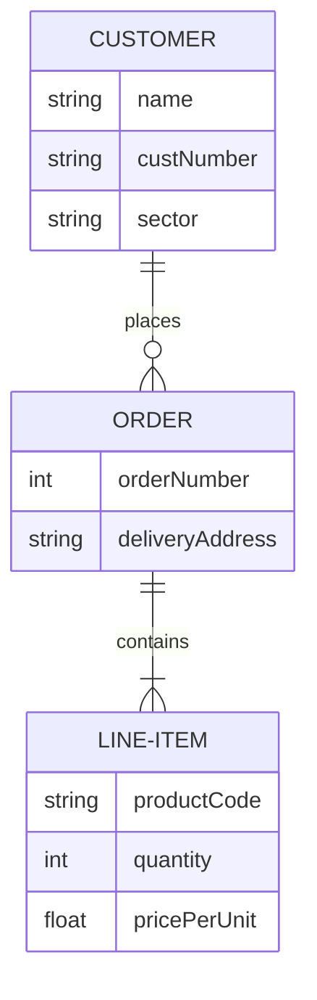

# 課題 23

## 課題 1

- タグが3つに制限される
- タグの重複が発生する
- タグの検索が複雑になる
- タグの追加・削除がしにくい
- タグ の一意性を保証できない

```mermaid
erDiagram
    CUSTOMER ||--o{ ORDER : places
    CUSTOMER {
        string name
        string custNumber
        string sector
    }

    ORDER ||--|{ LINE-ITEM : contains
    ORDER {
        int orderNumber
        string deliveryAddress
    }

    LINE-ITEM {
        string productCode
        int quantity
        float pricePerUnit
    }
```

https://catpot.dev/db-multi-column-attribute/