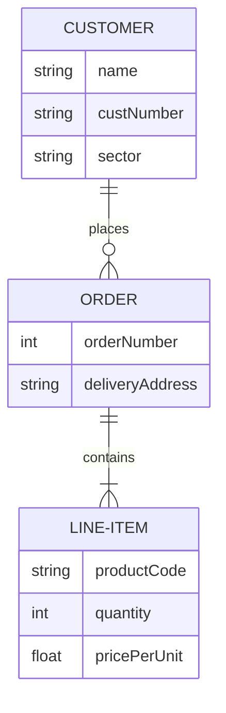

# 課題 23

## 課題 1

- タグが3つに制限される
- タグの一覧取得が困難
- タグの重複が発生する
- タグの検索が三つのカラムを見ないといけない
- 集約関数使う時、３つのタグを使わないといけない
- 特定のタグを削除したいときに、タグ１、タグ２、タグ３を見ないといけないま

```mermaid
erDiagram
    CUSTOMER ||--o{ ORDER : places
    CUSTOMER {
        string name
        string custNumber
        string sector
    }
    ORDER ||--|{ LINE-ITEM : contains
    ORDER {
        int orderNumber
        string deliveryAddress
    }
    LINE-ITEM {
        string productCode
        int quantity
        float pricePerUnit
    }
```
